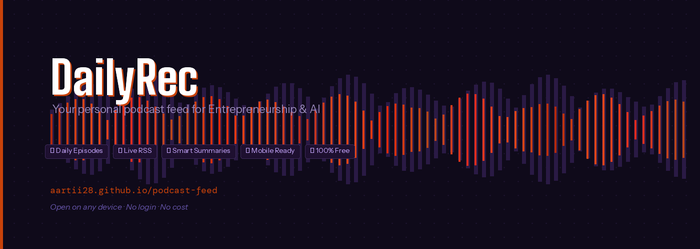
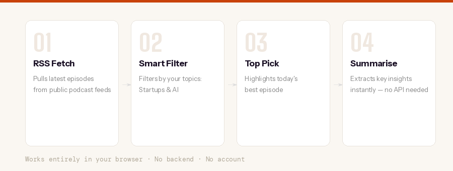
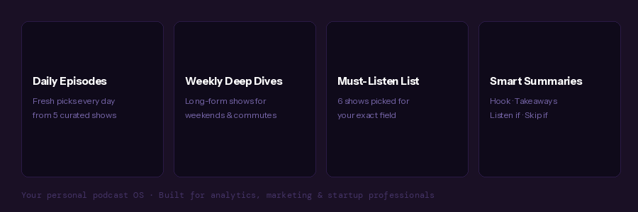

# DailyRec — Your Personal Podcast Feed

> A free, no-login, mobile-ready podcast recommender built for professionals in **Entrepreneurship, Analytics & AI**.  
> Open it every morning like a newspaper. Your curated feed is ready.

**🔗 Live:** [aartii28.github.io/podcast-feed](https://aartii28.github.io/podcast-feed)

---



---

## What It Does

DailyRec is a single HTML file that runs entirely in your browser. Every time you open it, it:

- Fetches the **latest episode** from 9 curated podcast RSS feeds
- Highlights **Today's Top Pick** — the most relevant episode for your topics
- Lets you read a **Smart Summary** of any episode instantly — hook, key takeaways, and a listen/skip recommendation
- Works on **mobile and desktop** — bookmark it, add it to your home screen

No backend. No database. No account. No cost.

---



---

## Tabs

| Tab | What's Inside |
|-----|--------------|
| **Daily Episodes** | 5 shows · fresh episodes every day · top pick highlighted |
| **Weekly Deep Dives** | 4 long-form shows · best for weekends and commutes |
| **Must-Listen List** | 6 shows hand-picked for your exact field |

---

## Podcast Shows

### 🚀 Entrepreneurship & Startups
| Show | Why It's Here |
|------|--------------|
| My First Million | Business ideas, real research, Sam & Shaan's riffs |
| How I Built This | Founder origin stories — resilience & product-market fit |
| Indie Hackers | Bootstrapped founders going from $0 to MRR |
| Lenny's Podcast | Operators, product leaders, revenue playbooks |
| The Tim Ferriss Show | Systems, habits, mental models from world-class performers |

### 🤖 Analytics & AI
| Show | Why It's Here |
|------|--------------|
| Practical AI | LLMs and AI in the real world, no hype |
| The AI Breakdown | Enterprise AI — what's actually shipping |
| Lex Fridman Podcast | Deep conversations with top AI researchers |
| TWIML AI Podcast | How ML teams actually build and ship products |

### 📌 Must-Listen (Curated for Your Field)
- **Analytics Power Hour** — the only podcast made for digital analytics practitioners
- **Marketing Against The Grain** — unconventional growth strategies from HubSpot
- **The Revenue Formula** — GTM, CRO, and revenue architecture
- **Data Skeptic** — rigorous data science without the fluff
- **How I Built This** — non-negotiable for any founder
- **Lenny's Podcast** — your closest advisor in podcast form

---

## Smart Summary

Click **✦ AI Summary** on any episode card to get:

```
"Hook" — one sentence to decide in 5 seconds

📝 WHAT IT COVERS
  3–4 sentences on the core argument and frameworks

✅ KEY TAKEAWAYS
  1. Specific, actionable insight
  2. Specific, actionable insight
  3. Specific, actionable insight

🎯 LISTEN IF   |   ⏭ SKIP IF
  Who gets the   |   Who can safely
  most from this |   skip this one
```

Summaries are generated instantly from the episode description — no API key, no cost.

---

## Mobile — Add to Home Screen

**iPhone:** Open in Safari → Share → *Add to Home Screen*

**Android:** Open in Chrome → Menu (⋮) → *Add to Home Screen*

It appears as an app icon on your home screen. Tap it every morning.

## Tech Stack

| Layer | What |
|-------|------|
| Hosting | GitHub Pages (free) |
| Framework | React 18 (via CDN, no build step) |
| Data | Public podcast RSS feeds via CORS proxy |
| Summaries | Rule-based NLP on episode descriptions |
| Fonts | Google Fonts (Playfair Display + DM Sans) |

---

## Built By

Made as a personal automation project.  
Topics: Digital Analytics · Marketing · Entrepreneurship · AI

---

*No ads. No tracking. No login. Just podcasts.*
